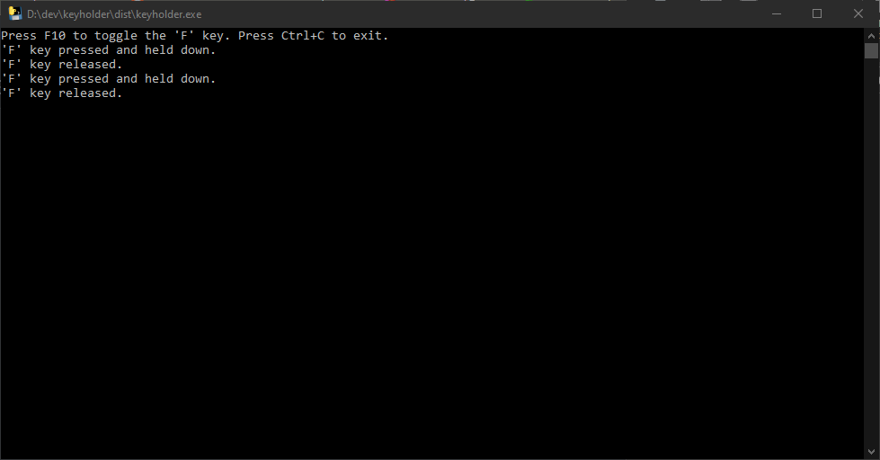

# Palworld F Key Pressed Script

Script to keep the F key pressed while crafting in palworld

[https://www.pocketpair.jp/palworld](https://www.pocketpair.jp/palworld)


## Overview

Palworld F Key Pressed Script is a Python script that allows you to toggle the 'F' key on Windows by pressing F10. The script uses the pynput library to capture keyboard events and the pyautogui library to simulate key presses.

## Setup

### Prerequisites

- Python 3.x installed on your system.

### Installation

1. **Clone the Repository:**

   ```bash
   git clone https://github.com/Benny93/palworld-keyholder.git
   cd Benny93/palworld-keyholder
   ```

2. **Install Dependencies:**

   Run the following command to install the required dependencies:

   ```bash
   pip install -r requirements.txt
   ```

### Usage

1. **Run the Script:**

   Execute the script by running the following command:

   ```bash
   python main.py
   ```

   The script will start listening for F10 key presses. Press F10 to toggle the 'F' key.

2. **Exit the Script:**

   To stop the script, press strg+c. This will release the 'F' key (if pressed) and exit the script.

## Building a Standalone Executable (Optional)

If you want to distribute the script as a standalone executable on Windows, you can use PyInstaller.

1. **Install PyInstaller:**

   ```bash
   pip install pyinstaller
   ```

2. **Create the Executable:**

   ```bash
   pyinstaller --onefile main.py --name keyholder -p .\venv\Lib\site-packages\
   ```

   The standalone executable will be located in the `dist` folder.
